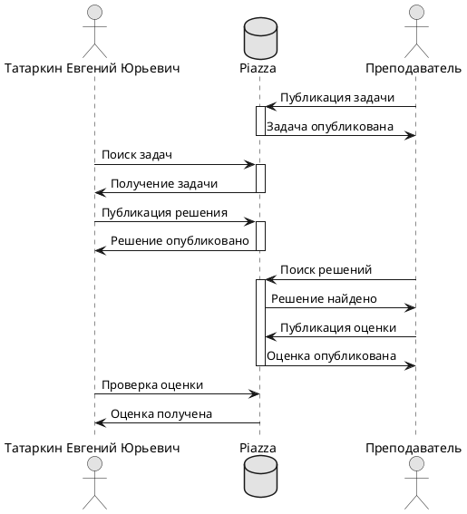

# Практическое занятие №7. Генераторы документации

П.Н. Советов, РТУ МИРЭА

## Задача 1

Реализовать с помощью математического языка LaTeX нижеприведенную формулу:


Прислать код на LaTeX и картинку-результат, где, помимо формулы, будет указано ФИО студента.

Решение:


<hr>

```Latex
\documentclass[12pt]{article}
\usepackage{amsmath}
\usepackage{amsfonts}

\begin{document}
Tatarkin Evgeniy 

\[
\int_{x}^{\infty} \frac{dt}{t(t^2-1)\log t} = \int_{x}^{\infty} \frac{1}{t \log t} \left( \sum_{m} t^{-2m} \right) dt 
= \sum_{m} \int_{x}^{\infty} \frac{t^{-2m}}{t \log t} dt^{(u = t^{-2m})} = -\sum_{m} \text{li}(x^{-2m})
\]
\end{document}

```

## Задача 2
На языке PlantUML реализовать диаграмму на рисунке ниже. Прислать текст на PlantUML и картинку-результат, в которой ФИО студента заменены Вашими собственными. Обратите внимание на оформление, желательно придерживаться именно его, то есть без стандартного желтого цвета и проч. Чтобы много не писать используйте псевдонимы с помощью ключевого слова "as".


<hr>
Решение:



